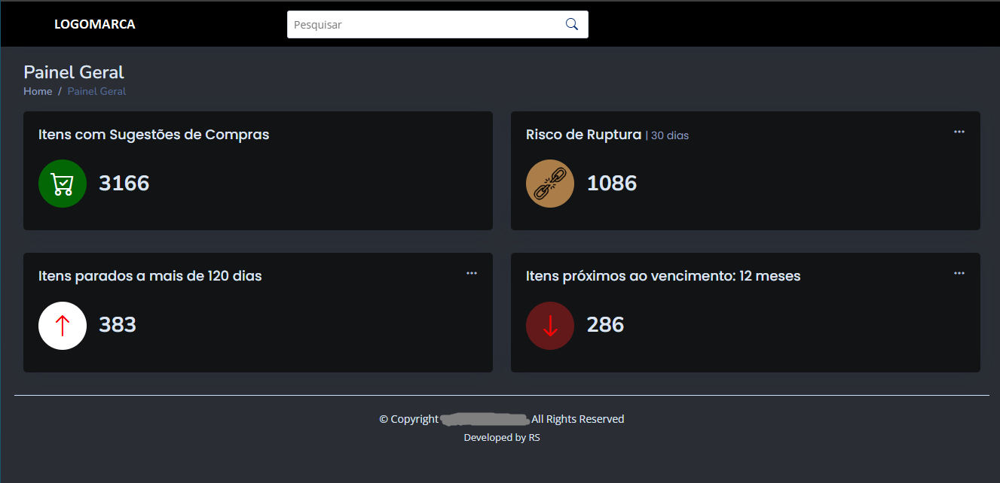
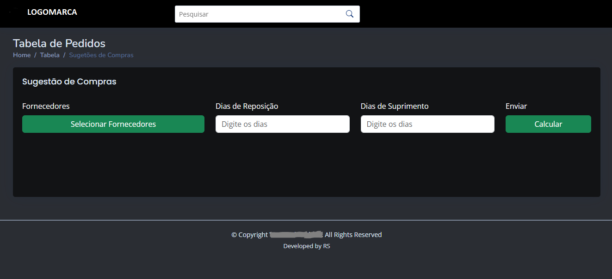
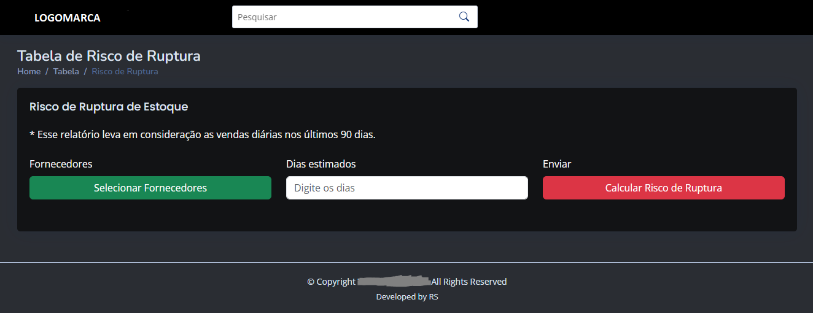
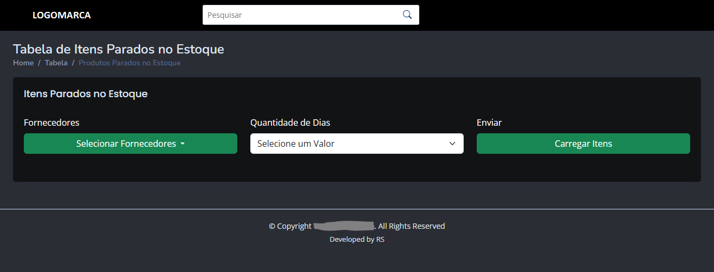
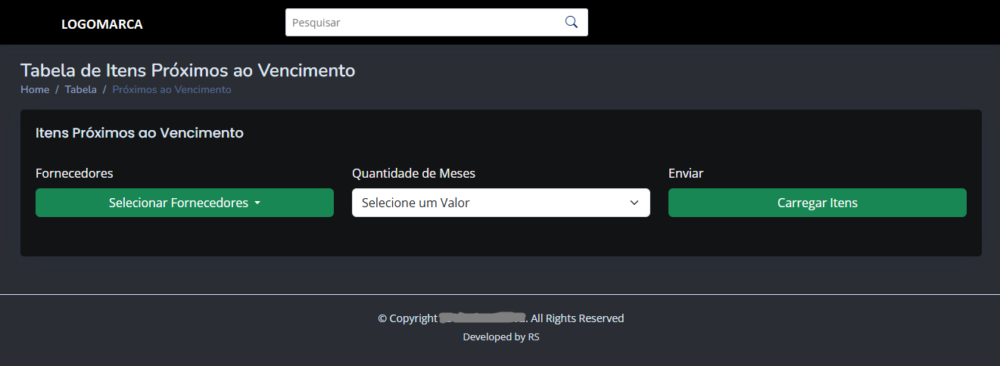

# Sistema de Análise de Estoque e Compras

Sistema web para **geração de relatórios gerenciais de compras e estoque**. Fornece módulos para *sugestão de compra*, *risco de ruptura*, *itens parados* e *itens próximos ao vencimento*.  

---

## Visão Geral
A aplicação permite:
- Consultar produtos por fornecedor e filtros (dias, meses).
- Calcular sugestões de compra com base em histórico de vendas.
- Identificar risco de ruptura (média dos últimos 90 dias).
- Listar itens parados por períodos (30/60/90/120 dias).
- Listar itens próximos ao vencimento (1–13 meses).
- Gerar relatórios em **PDF** (PDFs gerados via ReportLab e salvos em `static/reports_files/`).

---

## Funcionalidades Principais

- **Módulo Geral**  
  - Visão geral do Sistema  
  - Indicadores em tempo real

- **Módulo Sugestão de Compras**    
  - Sugestão de compra baseada em consumo e previsão  
  - Possibilidade de geração de relatório PDF 

- **Módulo Risco de Ruptura**  
  - Previsão de ruptura de produtos baseados no estoque atual e média de vendas nos últimso 90 dias 
  - Possibilidade de geração de relatório PDF  

- **Módulo Itens Parados no Estoque**   
  - Relatório de produtos parados no estoque com 30, 60, 90 ou 120 dias
  - Possibilidade de geração de relatório PDF 

- **Módulo Itens Próximos ao Vencimento**   
  - Relatório de produtos próximos ao vencimento (variando 1 mês até 13 meses), retorna produto e o seu respectivo lote
  - Possibilidade de geração de relatório PDF
  
---

## Arquitetura e Tecnologias
**Backend**
- Python 3.8+  
- Flask (Blueprints)  
- reportlab (geração de PDF)  
- pyodbc (conexão com SQL Server)  
- python-dotenv (`.env`)  
- flask-cors  
- threading (Lock para evitar concorrência na geração de relatórios)

**Frontend**
- HTML5 / CSS3 / Bootstrap  
- JavaScript  
- simple-datatables (utilizado em `main.js`)  
- Estrutura: páginas estáticas servidas em `frontend/` (ex.: `index.html`, `purchase-suggestions.html`, `rupture-risk.html`, `stopped-products.html`, `close-to-expiration.html`)

---

## 🗂 Estrutura Geral do Sistema

> **Legenda:**  
> O diagrama acima mostra o fluxo geral de funcionamento do sistema, desde o acesso do usuário ao módulo geral, entradas de dados, relatórios, até a geração dos arquivos.

---

## 🖼 Capturas de Tela

### 🔹 Módulo Geral

### 🔹 Módulo Sugestão de Compras

### 🔹 Módulo Risco de Ruptura

### 🔹 Módulo Itens Parados no Estoque

### 🔹 Módulo Itens Próximos ao Vencimento

> As imagens acima são exemplos das telas reais do sistema em funcionamento.

---

## Endpoints da API (conforme `app.py` e `routes/reports.py`)

**GET**
- `GET /api/suppliers`  
- `GET /api/products?supplier_name[]=...&replacement_days=...&supply_days=...`  
- `GET /api/total-suggestions`  
- `GET /api/rupture-risk?supplier_name[]=...&days_estimate=...`  
- `GET /api/rupture-risk-count?days_estimate=...`  
- `GET /api/maturity-items-count?months=...`  
- `GET /api/items-close-expiration?supplier_name[]=...&months=...`  
- `GET /api/items-stopped?days=...`  
- `GET /api/stagnant-items?supplier_name[]=...&days=...`  
- `GET /static/reports_files/<path:filename>` (serve arquivos PDF gerados)

**POST**
- `POST /api/generate_report`  
- `POST /api/generate_rupture_report`  
- `POST /api/generate-expiration-report`  
- `POST /api/generate-stagnant-report`  

> Observação: os endpoints acima aceitam JSON conforme a lógica implementada em `routes/reports.py` (ex.: `suppliers`, `table_data`, `file_format`, `months`, `days_estimate`).

---

## Autor
Desenvolvido por: Rodrigo Silva (RS)
Se você tiver alguma dúvida ou sugestão, sinta-se à vontade para entrar em contato comigo em rodericus@alu.ufc.br
